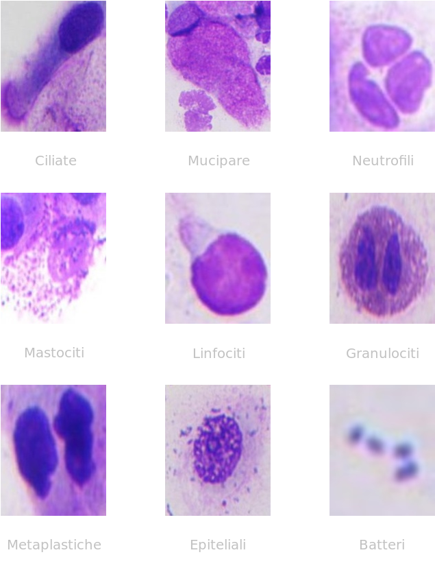

# Nasal cell classification 🔬

Progetto finale per il corso di Sistemi Multimediali 22-23 [Uniba](https://www.uniba.it/it/ricerca/dipartimenti/informatica).

## Obiettivo 🎯

Estrazione e testing di features da immagini cellulari provenienti dalla mucosa nasale.

**Documentazione completa**: [Report](docs/Report.pdf)

## Cellule della mucosa nasale 🧪

Le cellule sono l'unità strutturale e funzionale degli organismi viventi, il loro aspetto e la loro morfologia possono rispecchiare la natura biologica dell'organo e persino del corpo, in particolare la citologia nasale è una diagnostica dello studio delle rinopatie.

Inizialmente il dataset era composto da una serie di immagini di cellule, ogni immagine ne contava più di una insieme, per i nostri scopi si è andati ad isolare ogni singola cellula dalle immagini originali.

 
    

Figure 1: Differenti tipologie di cellule nel dataset

## Features extraction 🔮

Con l'obiettivo di estrarre delle informazioni dalle immagini cellulari si è andati a combinare diverse tipologie di features:

### 1. Feature Morfologiche

Per ogni contorno trovato si salvano area e perimetro.

### 2. Feature di Texture

Le caratteristiche della texture descrivono le variazioni nei livelli di grigio all'interno dell'immagine, usando le matrici di co-occorrenza a livelli di grigio (GLCM) è stato possibile estrapolare varie proprietà come:

- **Contrasto**: indica quanto variano i livelli di grigio tra i pixel vicini;
- **Dissimilarità**: tiene conto solo della differenza assoluta tra i livelli di grigio dei pixel vicini, senza elevarla al quadrato;
- **Omogeneità**: misura quanto i pixel vicini sono simili in termini di intensità;
- **Energia**: misura la quantità di ordine e ripetitività nella texture, valori elevati di energia indicano una texture altamente strutturata e ripetitiva;
- **Correlazione**: misura quanto una coppia di pixel varia in modo correlato rispetto alla media.

### 3. Feature di Colore

Le caratteristiche del colore sono importanti per descrivere le proprietà visive delle immagini delle cellule, in questo caso, per ogni immagine, si è andati a salvare l'istogramma dei colori.

## Learning 🧠

La combinazione delle features descritte è stata usata per allenare il modello `Random Forest` con l'obiettivo di catalogare le immagini cellulari.

  <table border="1">
    <tr>
      <th>Metrica</th>
      <th>Valore</th>
    </tr>
    <tr>
      <td>Accuracy</td>
      <td>0.800</td>
    </tr>
    <tr>
      <td>Precision</td>
      <td>0.782</td>
    </tr>
    <tr>
      <td>Recall</td>
      <td>0.800</td>
    </tr>
  </table>

