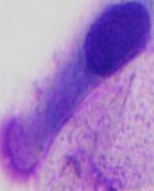
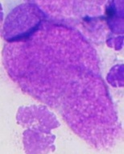
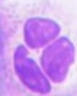
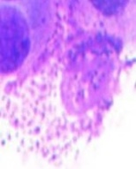
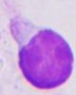
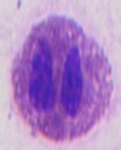
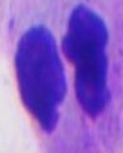
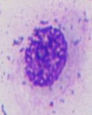
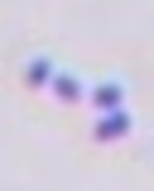
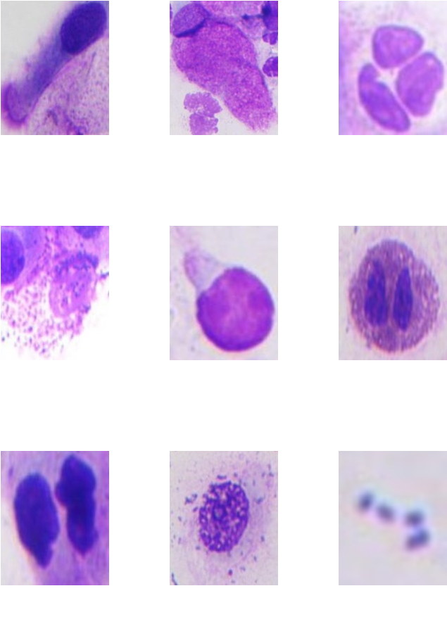

# Nasal cell classification 🔬

Progetto fiale per il corso di Sistemi Multimediali 22-23

## Obiettivo 🎯

Estrazione e testing di features da immagini cellulari provenienti dalla mucosa nasale.

**Documentazione completa**: insert link

## Cellule della mucosa nasale 🧪

Le cellule sono l'unità strutturale e funzionale degli organismi viventi, il loro aspetto e la loro morfologia possono rispecchiare la natura biologica dell'organo e persino del corpo, in particolare la citologia nasale è una diagnostica dello studio delle rinopatie.

Inizialmente il dataset era composto da una serie di immagini di cellule, ogni immagine contava più cellule insieme, per i nostri scopi si è andati ad isolare ogni singola cellula dalle immagini originali.

 

  

    
     
    Ciliate
  

  

    
     
    Mucipare
  

  

    
     
    Neutrofili
  

 

  

    
     
    Mastociti
  

  

    
     
    Linfociti
  

  

    
     
    Granulociti
  

 

  

    
     
    Metaplastiche
  

  

    
     
    Epiteliali
  

  

    
     
    Batteri
  

 
Figure 1: Differenti tipologie di cellule nel dataset

## Features extraction 🔮
Con l'obiettivo di estrarre delle informazioni dalle immagini cellulari si è andati a combinare diverse tipologie di features:

### 1. Feature Morfologiche
Per ogni contorno trovato si salvano aera e perimetro.

### 2. Features di Texture
Le caratteristiche della texture descrivono le variazioni nei livelli di grigio all'interno dell'immagine, usando le matrici di co-occorrenza a livello di grigio (GLCM) è stato possibile estrapolare varie proprietà come:

- **Contrasto**: indica quanto variano i livelli di grigio tra i pixel vicini; 
- **Dissimilarità**: tiene conto solo della differenza assoluta tra i livelli di grigio dei pixel vicini, senza elevarla al quadrato;
- **Omogeneità**:  misura quanto i pixel vicini sono simili in termini di intensità;
- **Energia**:  misura la quantità di ordine e ripetitività nella texture, Valori elevati di energia indicano una texture altamente strutturata e ripetitiva;
- **Correlazione**: misura quanto una coppia di pixel varia in modo correlato rispetto alla media.

### 3. Features di Colore
Le caratteristiche del colore sono importanti per descrivere le proprietà visive delle immagini delle cellule, in questo, caso per ogni immagine, si è andati a salvare l'istogramma dei colori.

 
    

